### Coffee Supply Chain Blockchain-Supply-Chain-PartB

Author: Sungho Maeung (smaeung@gmail.com)


The repository provides an Ethereum DApp application that explains about a Coffee Supply Chain between Farmers and Customers.

The user story is similar to any commonly used supply chain process. A Retailer can add submit orders of Coffee assets; then, the Farmer reviews the orders and approve them; following this, the distribution center receives the order and processit; once the order is ready, it is shipped to retailer for selling the coffee asset composing the order. The whole cycle of ordering is stored in the blockchain.  A Customer can buy Coffee assets, additonally a Retailer can mark an item as ForSale, and similarly a Customer can mark an item as Sold when the amount is sufficient and ownership is transfered to the Customer. 

The truffle framework is configured to deploy the smart contract in the Ethereum testnet, Rinkeby. The .secret file of this project is defined the Infura menmonic. 

The Dapp is deployed to the Ethereum testnet, Rinkeby. The Contract addresses are as below:

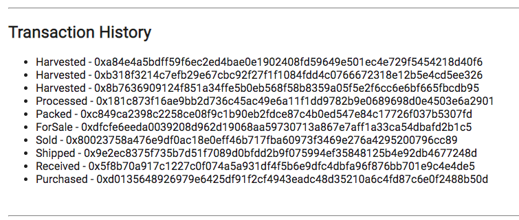

UML documents:
Activity Diagram:
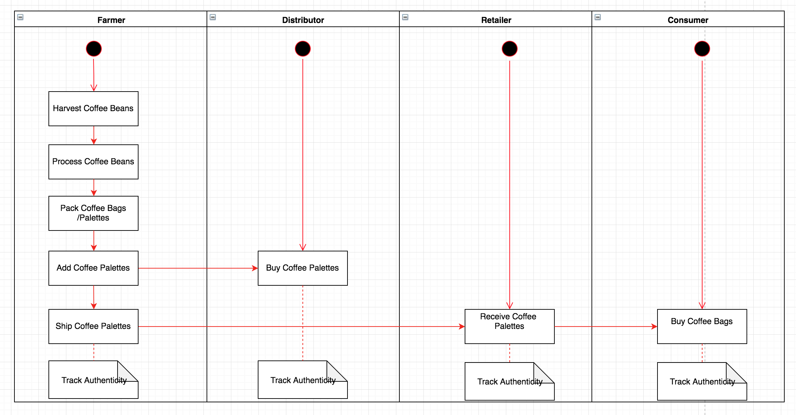

Sequence Diagram:
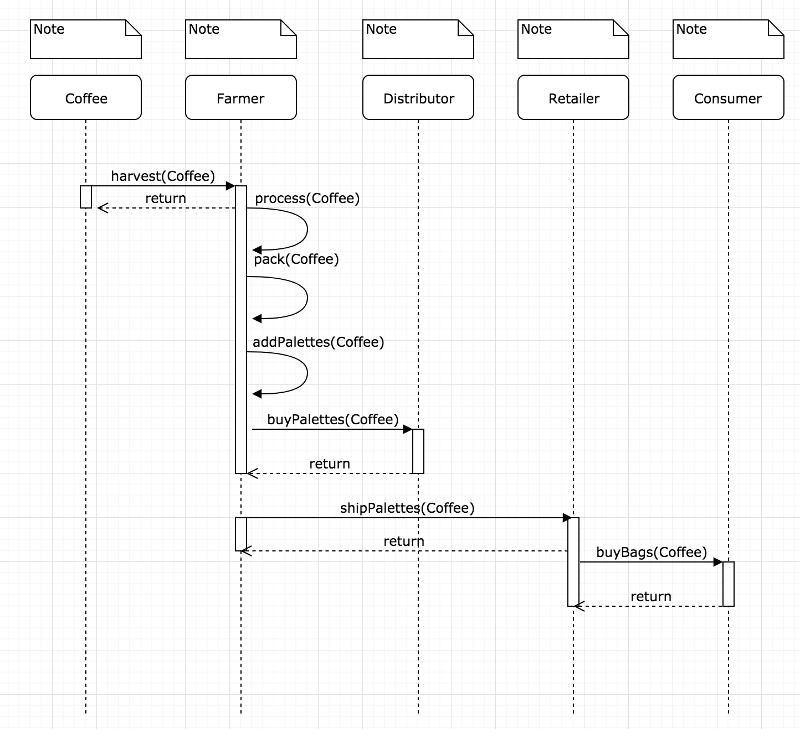

State Diagram:
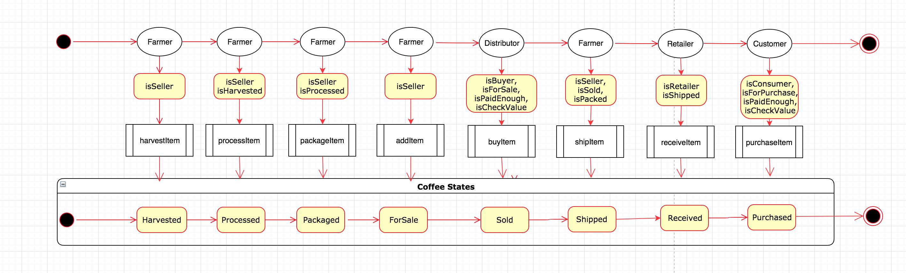

Class Diagram:
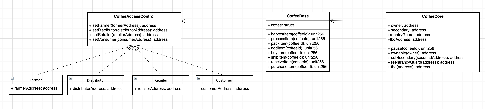


DApp User Interface:<br>
product detail:
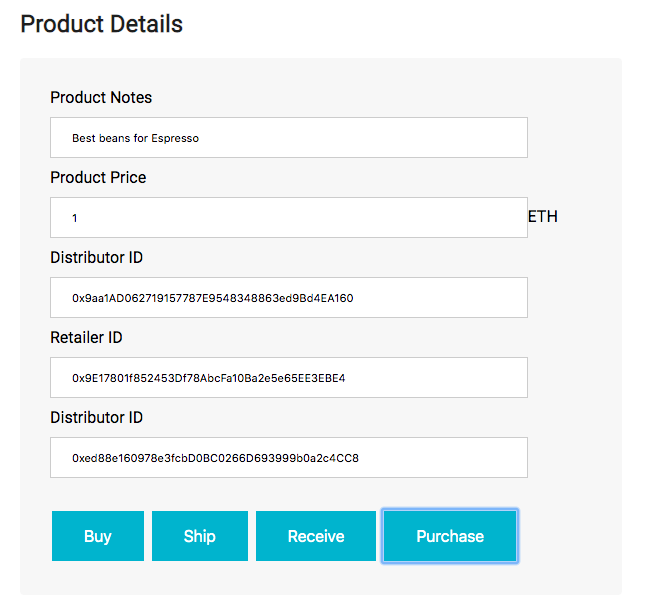

Farm detail 
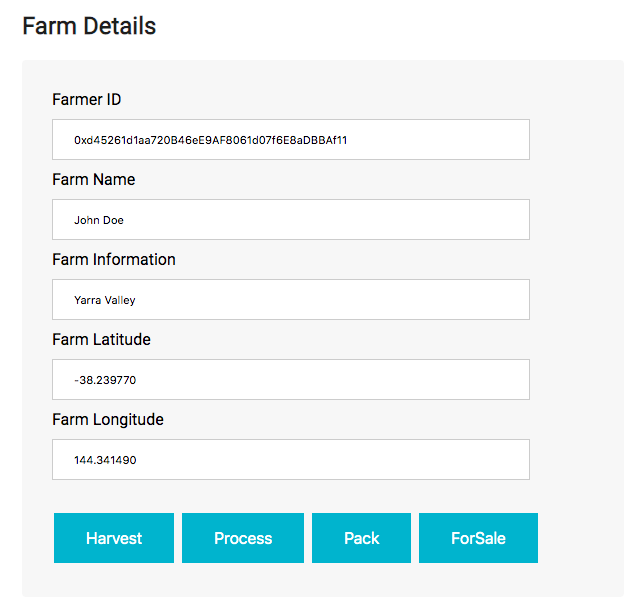

## Getting Started
### Prerequisties
please make sure you have already installed ganache-cli, Truffle and enabled MetaMask extension in your browser. To install essential library and components:

```
npm install
```

## Run Ganache:
```
ganache-cli -m "spirit supply whale amount human item harsh scare congress discover talent hamster"
```
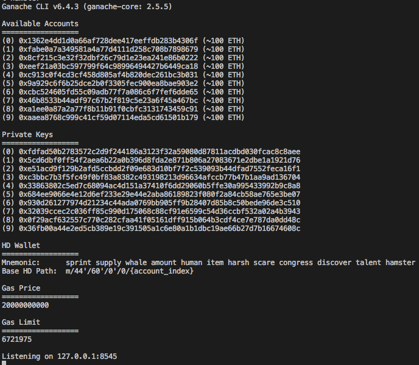

The first account is the contract owner ID. To make sure the front-end , the owner ID should be set up by the first account.  The Metamask also should be imported by this account.

To compile the contracts:

```
truffle compile
```
```
truffle migrate --reset
```
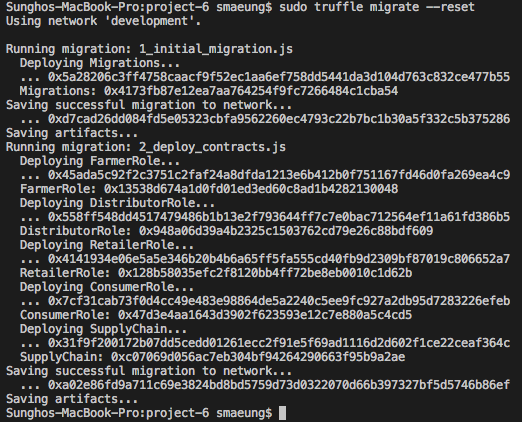

To test the contracts:
```
truffle test
```
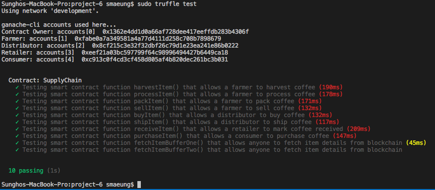

To run the DApp:
```
npm run dev
```
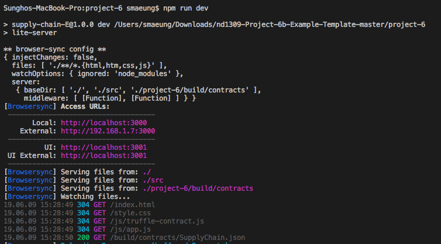

The product write-up that includes:
- Etherum - Ethereum decentralized platform for smart contacts
- IPFS - Distributed Web file storage framework.
- Truffle Framework - Ethereum development framwork
- Solidity v0.4.24
- Ganache-cli v6.4.3
- Truffle v4.1.15
- Node 8.11.3
- Web3.js v1.0.0-beta.37


